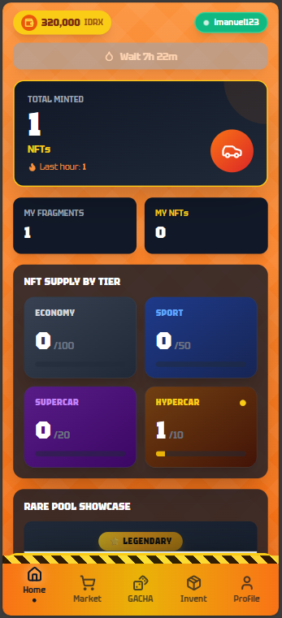
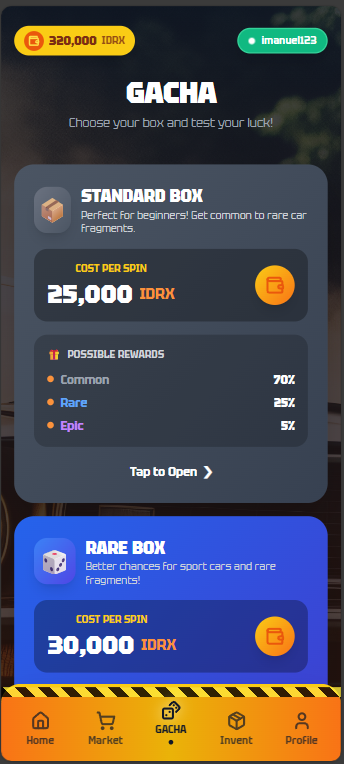
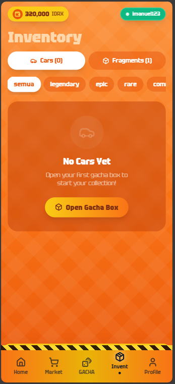

# 🏎️ MiniGarage

> **Collect. Build. Own.** - The Ultimate NFT Car Collection Platform on Base

[](https://base.org)
[](https://nextjs.org)
[](https://privy.io)

---

## 📋 Table of Contents

- [Overview](#-overview)
- [Features](#-features)
- [Tech Stack](#-tech-stack)
- [Architecture](#-architecture)
- [Getting Started](#-getting-started)
- [Smart Contracts](#-smart-contracts)
- [Demo](#-demo)
- [Team](#-team)

---

## 🎯 Overview

**MiniGarage** is a Web3 gaming platform that brings the thrill of collecting die-cast cars into the blockchain era. Players can collect, trade, and own exclusive NFT cars through an engaging gacha system, all powered by the Base blockchain.

### Problem Statement
Traditional digital collectibles lack true ownership and interoperability. Gamers spend money on in-game items that they don't truly own and can't trade freely.

### Our Solution
MiniGarage provides true digital ownership of collectible cars as NFTs on Base, with:
- **Gasless transactions** using MockIDRX tokens
- **Fragment-based crafting system** for building complete cars
- **Tiered gacha boxes** with transparent probability rates
- **Seamless onboarding** with Privy embedded wallets

---

## ✨ Features

| Feature | Description |
|---------|-------------|
| 🎰 **Gacha System** | 4-tier box system (Standard, Rare, Premium, Legendary) with car fragments and complete cars |
| 🔧 **Car Crafting** | Collect 5 fragments (Chassis, Wheels, Engine, Body, Interior) to mint a complete car NFT |
| 💼 **Digital Wallet** | Privy-powered embedded wallet with social login support |
| 🏪 **Marketplace** | Trade cars and fragments with other collectors |
| 📦 **Inventory** | Manage your collection with detailed car stats and rarity info |
| 🎨 **PWA Support** | Install as a mobile app for the best experience |

---

## 🛠️ Tech Stack

### Frontend
- **Framework:** Next.js 15 (App Router)
- **Styling:** Tailwind CSS
- **Auth:** Privy React Auth
- **Icons:** Lucide React
- **PWA:** next-pwa

### Blockchain
- **Network:** Base (Ethereum L2)
- **Token:** MockIDRX (ERC-20)
- **NFTs:** ERC-721 (Cars & Fragments)
- **Library:** ethers.js v6

### Backend
- Node.js / Express
- PostgreSQL
- Smart Contract Integration

---

## 🏗️ Architecture

```
┌─────────────────┐     ┌─────────────────┐     ┌─────────────────┐
│                 │     │                 │     │                 │
│   Next.js PWA   │────▶│  Backend API    │────▶│  Base Network   │
│   (Frontend)    │     │  (Node.js)      │     │  (Blockchain)   │
│                 │     │                 │     │                 │
└─────────────────┘     └─────────────────┘     └─────────────────┘
        │                       │                       │
        │                       │                       │
        ▼                       ▼                       ▼
   Privy Auth            PostgreSQL DB           Smart Contracts
   (Embedded Wallet)     (User Data)             (NFT & Token)
```

---

## 🚀 Getting Started

### Prerequisites
- Node.js 18+
- npm or yarn
- Privy Account (for API keys)

### Installation

```bash
# Clone the repository
git clone https://github.com/your-team/minigarage.git
cd minigarage/frontend

# Install dependencies
npm install

# Set up environment variables
cp .env.example .env.local
# Edit .env.local with your Privy API keys and backend URL

# Run development server
npm run dev
```

### Environment Variables

```env
NEXT_PUBLIC_PRIVY_APP_ID=your_privy_app_id
NEXT_PUBLIC_BACKEND_URL=http://localhost:3001
NEXT_PUBLIC_CHAIN_ID=8453
```

### Production Build

```bash
npm run build
npm run start
```

---

## 📜 Smart Contracts

| Contract | Description | Address |
|----------|-------------|---------|
| MockIDRX | ERC-20 Game Token | `0x...` |
| CarNFT | ERC-721 Car Collection | `0x...` |
| FragmentNFT | ERC-721 Car Fragments | `0x...` |
| GachaVault | Gacha Box Logic | `0x...` |

---

## 🎮 Demo

- **Live Demo:** [minigarage.app](https://minigarage.app)
- **Video Demo:** [YouTube Link](#)

### Screenshots

<p align="center">
  
  
  
</p>

---

## 👥 Team

| Name | Role | GitHub |
|------|------|--------|
| Diva Filemon | Full Stack Developer | [@github](#) |
| Imanuel Putra | Smart Contract Developer | [@github](#) |
| Sargio | UI/UX Designer | [@github](#) |

---

## 📄 License

This project is built for hackathon purposes. MIT License.

---

<p align="center">
  <b>Built with ❤️ for Base Hackathon 2026</b>
</p>
