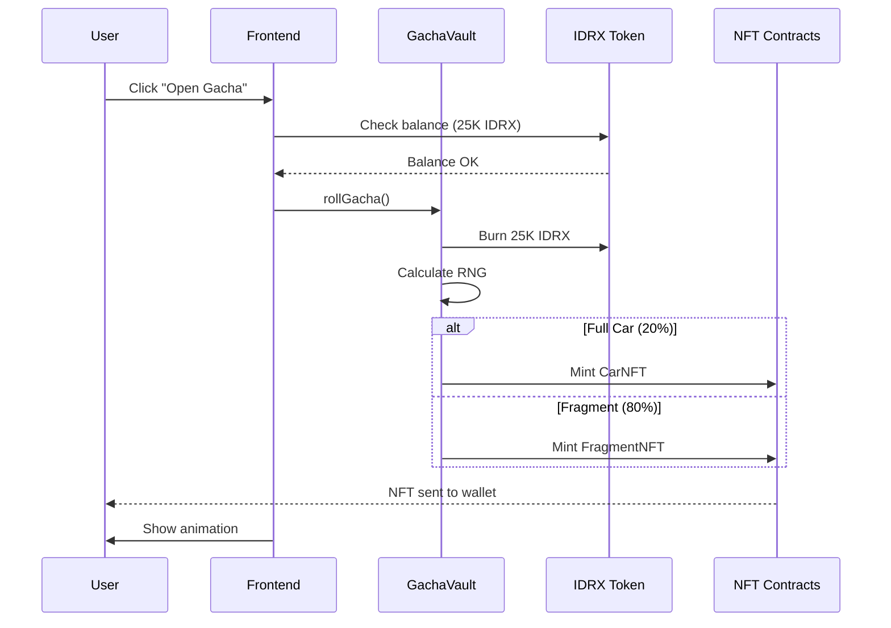
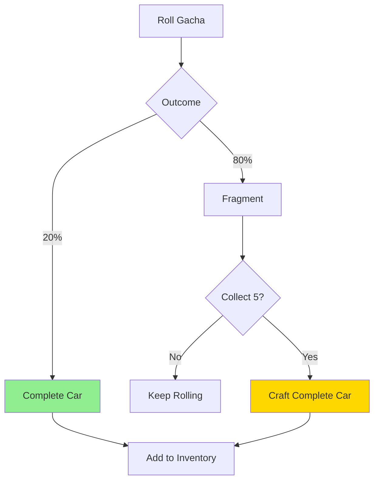
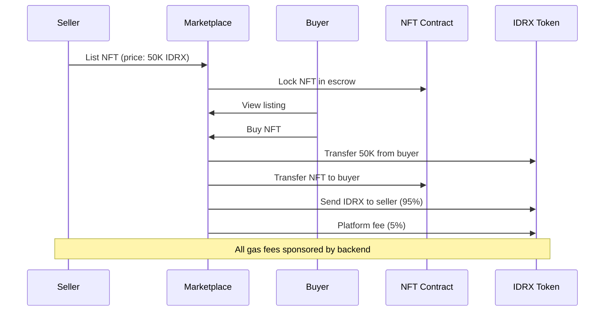
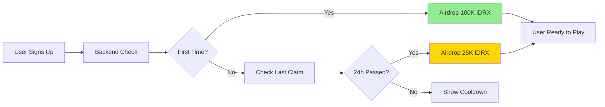
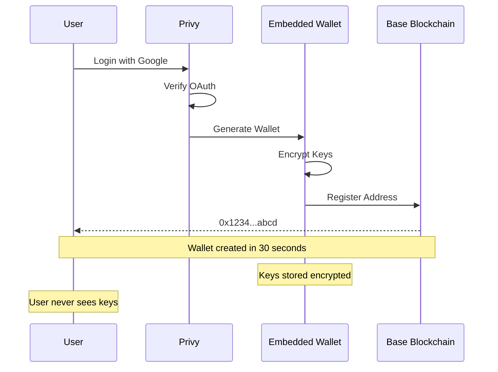

# Key Features

## 🎯 What Makes MiniGarage Special

MiniGarage combines the best of gaming, collecting, and blockchain to create a unique experience. Here are the features that set us apart.

---

## 1. 🎰 Gacha System with Real Ownership

### How It Works



### Tier System

<table data-card-size="large" data-view="cards"><thead><tr><th></th><th></th><th></th></tr></thead><tbody><tr><td><strong>🥉 Common</strong></td><td>50% drop rate</td><td>• Most accessible<br>• Good for beginners<br>• Trade value: 5-10K IDRX</td></tr><tr><td><strong>🥈 Rare</strong></td><td>30% drop rate</td><td>• Better designs<br>• Moderate rarity<br>• Trade value: 20-50K IDRX</td></tr><tr><td><strong>🥇 Epic</strong></td><td>15% drop rate</td><td>• Premium quality<br>• Collector's items<br>• Trade value: 100-200K IDRX</td></tr><tr><td><strong>💎 Legendary</strong></td><td>5% drop rate</td><td>• Ultra rare<br>• Status symbols<br>• Trade value: 500K+ IDRX</td></tr></tbody></table>

### Costs

| Action | Cost | Reward |
|--------|------|--------|
| **Standard Roll** | 25,000 IDRX | 1 car or 1 fragment |
| **10x Roll** | 225,000 IDRX (10% discount) | 10 cars/fragments |
| **Fragment Crafting** | 5 fragments | 1 complete car (guaranteed tier) |

---

## 2. 🧩 Fragment Crafting System

### The Innovation

Unlike pure RNG gacha, MiniGarage offers **guaranteed progression**:

```
Traditional Gacha:
┌──────┐
│ Roll │ → Random reward
└──────┘
Problem: Could roll 100x and never get legendary ❌

MiniGarage:
┌──────┐     ┌──────────┐     ┌──────────────┐
│ Roll │ →  │ Fragment │  →  │ Collect 5 → CAR │
└──────┘     └──────────┘     └──────────────┘
Solution: Guaranteed legendary after 25 rolls ✅
```

### How Fragment Assembly Works



**Fragment Types:**
- Each fragment has a **tier** (Common/Rare/Epic/Legendary)
- Collect **5 fragments of same tier** = guaranteed car of that tier
- Fragments are **tradeable NFTs**
- Can mix and match from different gacha rolls

**Example Journey:**
```
Day 1: Roll 10x gacha
Result: 2 complete cars, 8 fragments (3 rare, 5 common)

Day 3: Collect 2 more common fragments
Action: Craft 1 common car (5 fragments → 1 car) ✅

Day 7: Buy 2 rare fragments from marketplace
Action: Craft 1 rare car (5 fragments → 1 car) ✅

Total: Started with RNG, ended with guaranteed rewards!
```

---

## 3. 🏪 Peer-to-Peer Marketplace

### Trading Features

<table data-card-size="large" data-view="cards"><thead><tr><th></th><th></th></tr></thead><tbody><tr><td><strong>🚗 Car NFTs</strong></td><td>• Buy/sell complete cars<br>• Set your own prices<br>• Filter by tier/model<br>• Instant transfers</td></tr><tr><td><strong>🧩 Fragments</strong></td><td>• Trade specific fragment tiers<br>• Complete your collection<br>• Lower entry prices<br>• Build toward goal cars</td></tr><tr><td><strong>💰 IDRX Only</strong></td><td>• No ETH required<br>• Predictable pricing<br>• Cultural relevance<br>• Sponsored gas fees</td></tr></tbody></table>

### Marketplace Flow



### Fee Structure

| Transaction Type | Buyer | Seller | Platform |
|------------------|-------|--------|----------|
| **List NFT** | - | Free | Sponsors gas |
| **Buy NFT** | Pays IDRX price | - | Sponsors gas |
| **Platform Fee** | - | 5% of sale | Revenue |
| **Cancel Listing** | - | Free | Sponsors gas |

**Example:**
```
Seller lists Legendary Car for 500K IDRX

When sold:
• Buyer pays: 500K IDRX
• Platform keeps: 25K IDRX (5%)
• Seller receives: 475K IDRX (95%)
• Gas fees: $0 (sponsored) ✅
```

---

## 4. 🎨 Diverse Car Collection

### Car Models

We have **12 unique car models** across 4 tiers:

#### 🥉 Common Tier (3 models)
- **City Commuter** - Compact hatchback
- **Family Sedan** - Practical daily driver
- **Delivery Van** - Utility vehicle

#### 🥈 Rare Tier (3 models)
- **Sports Coupe** - Performance-focused
- **Luxury Sedan** - Premium comfort
- **Off-Road SUV** - Adventure ready

#### 🥇 Epic Tier (3 models)
- **Supercar** - Exotic performance
- **Classic Muscle** - American power
- **Hypercar** - Ultimate speed

#### 💎 Legendary Tier (3 models)
- **F1 Racer** - Track monster
- **Concept Car** - Futuristic design
- **Vintage Classic** - Historical treasure

### Visual Assets

All cars feature:
- ✅ **High-quality 3D models**
- ✅ **Multiple angles** (front, side, top)
- ✅ **Rarity-based styling** (different colors/effects per tier)
- ✅ **Metadata** (car name, tier, stats, serial number)

---

## 5. 🎁 Faucet & Airdrop System

### Free-to-Start

New users get:

<table data-card-size="large" data-view="cards"><thead><tr><th></th><th></th></tr></thead><tbody><tr><td><strong>🎯 First-Time Bonus</strong></td><td>• 100,000 IDRX on signup<br>• Enough for 4 gacha rolls<br>• No payment required<br>• Instant claim</td></tr><tr><td><strong>🔄 Daily Faucet</strong></td><td>• 25,000 IDRX per day<br>• 1 free gacha daily<br>• Encourages return visits<br>• Rate-limited per wallet</td></tr><tr><td><strong>🎊 Event Airdrops</strong></td><td>• Special occasions<br>• Milestone rewards<br>• Community growth<br>• Bonus IDRX amounts</td></tr></tbody></table>

### Airdrop Flow



---

## 6. 🔐 Privy Authentication

### Seamless Login

<table data-card-size="large" data-view="cards"><thead><tr><th></th><th></th></tr></thead><tbody><tr><td><strong>📧 Email</strong></td><td>Magic link login<br>No password needed</td></tr><tr><td><strong>🌐 Google</strong></td><td>OAuth integration<br>One-click access</td></tr><tr><td><strong>🐦 Twitter</strong></td><td>Social login<br>Share achievements</td></tr><tr><td><strong>💬 Discord</strong></td><td>Community integration<br>Gamer-friendly</td></tr></tbody></table>

### Embedded Wallet Benefits

| Feature | Traditional Wallet | Privy Embedded |
|---------|-------------------|----------------|
| **Setup Time** | 10+ minutes | 30 seconds |
| **Seed Phrase** | Required ❌ | Not needed ✅ |
| **Gas Management** | Manual ❌ | Sponsored ✅ |
| **Recovery** | Phrase backup ❌ | Email recovery ✅ |
| **User Experience** | Complex ❌ | Simple ✅ |

### How It Works



---

## 7. 📱 Progressive Web App (PWA)

### Mobile-First Design

MiniGarage is built as a **PWA**, which means:

✅ **Installable** - Add to homescreen like native app
✅ **Offline Ready** - Cache static assets
✅ **Fast Loading** - Service worker optimization
✅ **Responsive** - Works on any screen size
✅ **Push Notifications** - (Coming soon)

### Installation

```
Android/iOS:
1. Visit minigarage.app
2. Tap "Add to Home Screen"
3. Icon appears on device
4. Launch like native app! ✅
```

### Performance Optimizations

| Feature | Implementation | Benefit |
|---------|---------------|---------|
| **Next.js 15** | Server components | Faster initial load |
| **Image Optimization** | next/image | Automatic WebP/AVIF |
| **Code Splitting** | Dynamic imports | Smaller bundle sizes |
| **Route Prefetching** | Link preloading | Instant navigation |

---

## 8. 🎮 Gamification Elements

### Achievements (Coming Soon)

| Achievement | Requirement | Reward |
|-------------|-------------|--------|
| **First Roll** | Open 1 gacha | 10K IDRX |
| **Collector** | Own 10 cars | Exclusive badge |
| **Trader** | Complete 5 trades | Marketplace boost |
| **Lucky Strike** | Get legendary on first roll | Rare title |

### Leaderboards (Roadmap)

- 🏆 **Most NFTs Owned**
- 💰 **Highest IDRX Balance**
- 📈 **Trading Volume**
- 🎰 **Luckiest Roller** (legendary drops)

---

## 🎯 Feature Comparison

### MiniGarage vs Competitors

| Feature | Traditional Gacha | NFT Projects | MiniGarage |
|---------|-------------------|--------------|------------|
| **True Ownership** | ❌ | ✅ | ✅ |
| **Easy Onboarding** | ✅ | ❌ | ✅ |
| **Fragment System** | ❌ | ❌ | ✅ |
| **Gasless UX** | ✅ | ❌ | ✅ |
| **P2P Marketplace** | ❌ | ⚠️ | ✅ |
| **Physical Redemption** | ❌ | ❌ | ✅ (Roadmap) |

---

## 🚀 Coming Soon

### Alpha Phase (Q2 2024)

- [ ] **Mainnet Launch** - Migrate to Base mainnet
- [ ] **Achievement System** - Unlock rewards
- [ ] **Leaderboards** - Compete with friends
- [ ] **Trading History** - Track all transactions

### Beta Phase (Q3 2024)

- [ ] **Physical Redemption** - Convert NFT → real diecast car
- [ ] **Staking** - Earn IDRX from NFT holdings
- [ ] **Tournaments** - Limited-time events
- [ ] **Social Features** - Friend lists, chat

---


**Ready to Try MiniGarage?**

All features are live on testnet! Get started in 30 seconds:
👉 [Quick Start Guide](../getting-started/quick-start.md)


---

## Next Steps

<table data-card-size="large" data-view="cards"><thead><tr><th></th><th></th><th data-hidden data-card-target data-type="content-ref"></th></tr></thead><tbody><tr><td><strong>🚀 Quick Start</strong></td><td>Get started in 5 minutes</td><td><a href="../getting-started/quick-start.md">quick-start.md</a></td></tr><tr><td><strong>🏗️ Architecture</strong></td><td>Understand the system</td><td><a href="../technical/architecture.md">architecture.md</a></td></tr><tr><td><strong>🎰 Gacha System</strong></td><td>Deep dive into mechanics</td><td><a href="../features/gacha-system.md">gacha-system.md</a></td></tr></tbody></table>
