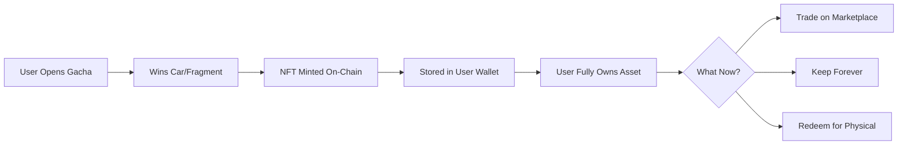
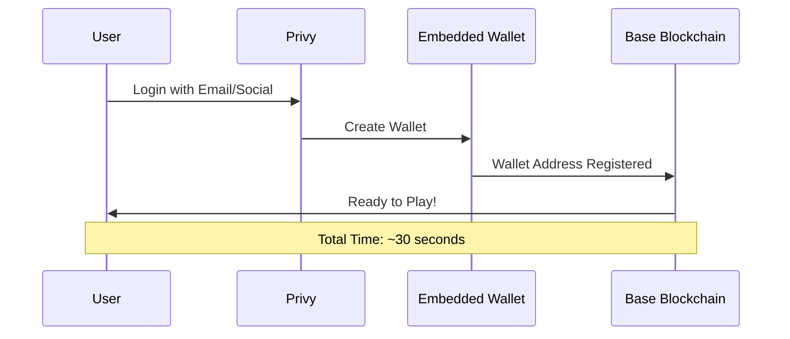

# Problem & Solution

## 🚨 The Problem

Traditional digital collectibles and in-game assets have **three critical flaws** that prevent true ownership and long-term value:

### 1. No True Ownership

<table data-card-size="large" data-view="cards"><thead><tr><th></th><th></th></tr></thead><tbody><tr><td><strong>❌ Traditional Games</strong></td><td>You spend money on in-game items, but the game company owns everything. When the game shuts down, you lose it all.</td></tr><tr><td><strong>✅ MiniGarage</strong></td><td>Every car is an NFT you truly own. Even if our platform closes, your NFTs remain on-chain forever.</td></tr></tbody></table>

**Example:**
> Player spends $500 on rare car skins in a mobile game. Game company decides to shut down the game. **Result:** Player loses everything, no refund, no way to transfer assets.

---

### 2. Complex Crypto Onboarding

<table data-card-size="large" data-view="cards"><thead><tr><th></th><th></th></tr></thead><tbody><tr><td><strong>❌ Most Web3 Games</strong></td><td>Require users to:<br>• Install MetaMask<br>• Write down 12-word seed phrase<br>• Buy ETH for gas<br>• Understand blockchain</td></tr><tr><td><strong>✅ MiniGarage</strong></td><td>Just login with:<br>• Email<br>• Google<br>• Twitter<br>• Discord<br><br>Wallet created automatically!</td></tr></tbody></table>

**Stats:**
- **95% of users** abandon Web3 apps during wallet setup
- **70% of beginners** lose access to wallets within first month
- MiniGarage **reduces onboarding to 30 seconds**

---

### 3. Lack of Gaming Collectibles on Base

<table data-card-size="large" data-view="cards"><thead><tr><th></th><th></th></tr></thead><tbody><tr><td><strong>❌ Current State</strong></td><td>Base has amazing DeFi and social apps, but lacks engaging collectible gaming experiences that bridge Web2 and Web3.</td></tr><tr><td><strong>✅ MiniGarage</strong></td><td>First major NFT car collection game on Base, combining mainstream appeal with blockchain benefits.</td></tr></tbody></table>

---

## ✅ Our Solution

MiniGarage addresses these problems with a **4-pillar approach**:

### 1. True Digital Ownership via NFTs



**Key Benefits:**
- ✅ **Permanent Ownership** - NFTs exist on Base blockchain forever
- ✅ **Provable Scarcity** - On-chain verification of rarity
- ✅ **Interoperability** - Works with any NFT marketplace
- ✅ **Transferable** - Gift, sell, or trade freely

---

### 2. Seamless Onboarding with Privy



**How It Works:**
1. User clicks "Login with Google"
2. Google OAuth authenticates
3. Privy generates embedded wallet
4. Wallet keys encrypted with user's OAuth token
5. User gets Base address automatically

**No Need For:**
- ❌ MetaMask installation
- ❌ Seed phrase management
- ❌ Gas fee confusion
- ❌ Network switching

---

### 3. Gasless UX with MockIDRX

Instead of requiring users to have ETH for every transaction, we use **IDRX tokens**:

| Action | Traditional Web3 | MiniGarage |
|--------|------------------|------------|
| **Open Gacha Box** | Pay 0.001 ETH (~$2) + gas | Pay 25K IDRX (free from faucet) |
| **Trade NFT** | Pay listing price + gas | Pay IDRX only, no gas |
| **Claim Reward** | User pays gas | Backend sponsors gas |

**Benefits:**
- ✅ Users never see gas fees
- ✅ Predictable costs in IDRX
- ✅ Familiar denominations (1M IDRX vs 0.0001 ETH)
- ✅ Cultural connection for Indonesian market

---

### 4. Fragment Crafting System

Unlike pure-RNG gacha games, MiniGarage adds **progression**:

```
Pure RNG (Traditional Gacha):
┌─────────┐
│ Open Box│ → Random Car (0.1% legendary)
└─────────┘
❌ Frustrating for unlucky players

MiniGarage (Fragment + RNG):
┌─────────┐     ┌──────────┐     ┌────────────┐
│ Open Box│ →  │ Fragment │  →  │ Collect 5  │ → Complete Car
└─────────┘     └──────────┘     └────────────┘
✅ Progress toward guaranteed reward
```

**Advantages:**
- ✅ **Reduces RNG Frustration** - Every pull has value
- ✅ **Adds Progression** - Work toward specific cars
- ✅ **Creates Economy** - Fragment trading marketplace
- ✅ **Increases Engagement** - Collection goals

---

## 🎯 Impact

### Before MiniGarage

```
User Journey (Traditional):
1. Install game → 10 min
2. Make in-game purchases → $100
3. Game shuts down → Lose everything
4. User frustrated → Never trusts again
```

### With MiniGarage

```
User Journey (MiniGarage):
1. Login with email → 30 sec
2. Claim free IDRX → 1 min
3. Open gacha boxes → 5 min
4. Own NFTs forever → Lifetime value
5. Trade or redeem → Full control
```

---

## 📊 Comparison

| Feature | Traditional Games | Other Web3 Games | MiniGarage |
|---------|-------------------|------------------|------------|
| **True Ownership** | ❌ No | ✅ Yes | ✅ Yes |
| **Easy Onboarding** | ✅ Yes | ❌ No | ✅ Yes |
| **Low Fees** | ✅ Yes | ❌ No | ✅ Yes |
| **Progression System** | ✅ Yes | ⚠️ Rare | ✅ Yes |
| **Blockchain Benefits** | ❌ No | ✅ Yes | ✅ Yes |

---


**MiniGarage = Best of Both Worlds**

We combine the accessibility of traditional games with the ownership benefits of Web3, without the usual friction.


---

## Next: Why Base?

Learn why we chose Base blockchain for optimal performance and cost efficiency →


[why-base.md](why-base.md)

