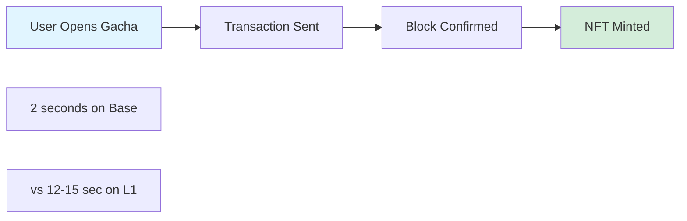
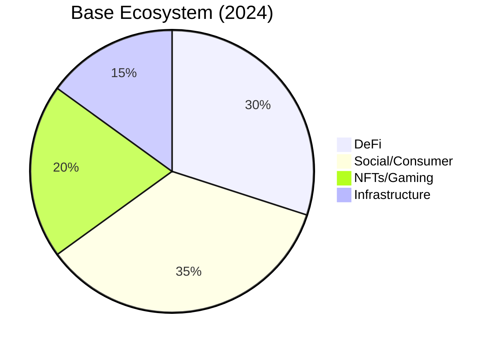
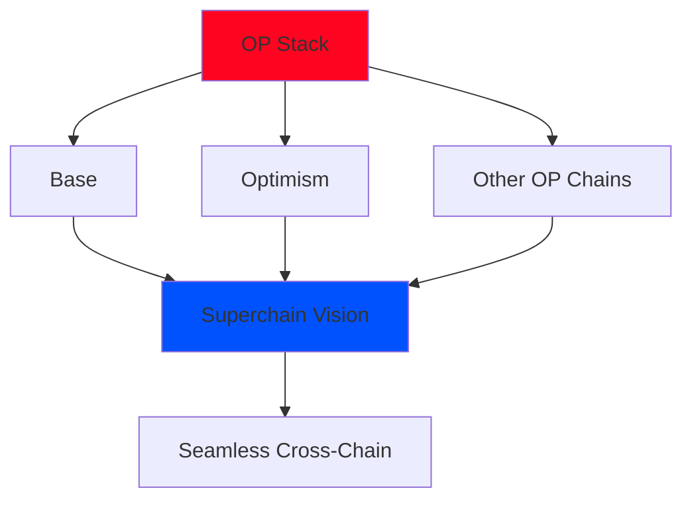
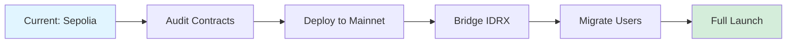

# Why Base?

## ⚡ Overview

MiniGarage is built on **Base Sepolia** (testnet) with plans to migrate to **Base Mainnet**. Here's why Base is the perfect blockchain for our NFT car collection platform.

---

## 🔍 The Selection Criteria

When choosing a blockchain for MiniGarage, we evaluated based on:

| Criterion | Weight | Winner |
|-----------|--------|--------|
| **Transaction Cost** | 🔥🔥🔥 High | Base |
| **Speed** | 🔥🔥🔥 High | Base |
| **Developer Experience** | 🔥🔥 Medium | Base |
| **Ecosystem Size** | 🔥🔥 Medium | Base |
| **User Onboarding** | 🔥🔥🔥 High | Base |

---

## ✅ Why Base Wins

### 1. Ultra-Low Gas Fees

<table data-card-size="large" data-view="cards"><thead><tr><th></th><th></th></tr></thead><tbody><tr><td><strong>Ethereum Mainnet</strong></td><td>• Mint NFT: $15-50<br>• Transfer: $5-20<br>• Gacha roll: $10-30<br><br>❌ Too expensive for gaming</td></tr><tr><td><strong>Base</strong></td><td>• Mint NFT: $0.01<br>• Transfer: &lt;$0.01<br>• Gacha roll: $0.02<br><br>✅ Affordable for everyone</td></tr></tbody></table>

**Real Example:**
```
Opening 10 Gacha Boxes:

On Ethereum:
• 10 IDRX purchases: $50
• 10 mint transactions: $150
• Total: ~$200 in gas

On Base:
• 10 IDRX purchases: $0.10
• 10 mint transactions: $0.10
• Total: ~$0.20 in gas

Savings: 99.9% cheaper! 💰
```

---

### 2. Fast Finality



**Speed Comparison:**

| Blockchain | Block Time | User Experience |
|------------|------------|-----------------|
| **Ethereum** | ~12-15 sec | ⚠️ Noticeable delay |
| **Polygon** | ~2 sec | ✅ Fast |
| **Base** | ~2 sec | ✅ Fast |
| **Arbitrum** | ~250ms | ✅ Very fast |

**Why 2 seconds is good enough:**
- ✅ Feels instant to users
- ✅ Animation can cover the wait
- ✅ No frustrating loading screens
- ✅ Competitive with Web2 games

---

### 3. EVM Compatibility

Base is **100% EVM-compatible**, which means:

| Benefit | Explanation |
|---------|-------------|
| **Use Solidity** | No new language to learn |
| **Existing Tools** | Hardhat, Ethers.js, Foundry work perfectly |
| **Audit Resources** | Same security best practices as Ethereum |
| **Interoperability** | Easy bridge to Ethereum and other L2s |

**Developer Experience:**
```javascript
// Code that works on Ethereum:
const contract = new ethers.Contract(address, abi, signer);
await contract.mintCar(tokenId);

// Works EXACTLY the same on Base - no changes needed! ✅
```

---

### 4. Backed by Coinbase

<table data-card-size="large" data-view="cards"><thead><tr><th></th><th></th></tr></thead><tbody><tr><td><strong>🏢 Institutional Trust</strong></td><td>Coinbase's reputation provides confidence for users and partners</td></tr><tr><td><strong>💼 Enterprise Support</strong></td><td>Access to Coinbase's infrastructure and services</td></tr><tr><td><strong>🌐 Onboarding Pipeline</strong></td><td>Millions of Coinbase users can easily try Base apps</td></tr><tr><td><strong>🛡️ Security</strong></td><td>Battle-tested infrastructure from crypto's largest exchange</td></tr></tbody></table>

---

### 5. Growing Ecosystem

Base is rapidly becoming the **L2 of choice for consumer apps**:



**Notable Base Projects:**
- **Friend.tech** - Social finance
- **Farcaster** - Decentralized social
- **Zora** - NFT marketplace
- **Aerodrome** - DEX
- **MiniGarage** - NFT car collection (that's us! 🚗)

**Why This Matters:**
- ✅ More users already on Base
- ✅ Better liquidity for our marketplace
- ✅ Cross-promotion opportunities
- ✅ Shared infrastructure costs

---

### 6. OP Stack = Future-Proof

Base is built on the **OP Stack** (Optimism's rollup framework):



**Superchain Benefits:**
- 🔗 **Native Interoperability** - Easy cross-chain NFT transfers
- 💸 **Shared Sequencer** - Lower costs through batching
- 🔐 **Unified Security** - Ethereum's security for all chains
- 🚀 **Network Effects** - User base grows across all OP chains

---

## 🆚 Base vs Alternatives

### Base vs Polygon

| Feature | Base | Polygon |
|---------|------|---------|
| **Gas Fees** | ✅ $0.01-0.05 | ✅ $0.01-0.10 |
| **Speed** | ✅ 2 sec blocks | ✅ 2 sec blocks |
| **Backing** | ✅ Coinbase | ⚠️ Independent |
| **EVM Compatibility** | ✅ 100% | ✅ 100% |
| **User Base** | 🔥 Growing fast | ✅ Established |

**Verdict:** Base chosen for **backing and growth trajectory**.

---

### Base vs Arbitrum

| Feature | Base | Arbitrum |
|---------|------|----------|
| **Gas Fees** | ✅ Cheaper | ⚠️ Slightly more |
| **Speed** | ✅ Fast | ✅ Very fast |
| **Consumer Focus** | ✅ Strong | ⚠️ More DeFi |
| **Coinbase Integration** | ✅ Native | ❌ No |

**Verdict:** Base better for **consumer onboarding**.

---

### Base vs Ethereum L1

| Feature | Base L2 | Ethereum L1 |
|---------|---------|-------------|
| **Gas Fees** | ✅ $0.01-0.05 | ❌ $5-50 |
| **Speed** | ✅ 2 seconds | ⚠️ 12-15 seconds |
| **Security** | ✅ Inherits from L1 | ✅ Maximum |
| **Decentralization** | ⚠️ Sequencer centralized | ✅ Fully decentralized |

**Verdict:** Base provides **99% of benefits at 0.1% of cost**.

---

## 🎯 Perfect for MiniGarage

Base checks all boxes for our use case:

```
MiniGarage Requirements → Base Features
━━━━━━━━━━━━━━━━━━━━━━━━━━━━━━━━━━━━━
✅ Cheap NFT mints     →  $0.01 per mint
✅ Fast confirmations  →  2-second blocks
✅ Easy onboarding     →  Coinbase ecosystem
✅ EVM compatibility   →  Use standard tools
✅ Growing user base   →  Consumer-focused L2
✅ Future-proof        →  OP Stack / Superchain
```

---

## 📊 Technical Specs

### Base Sepolia (Current Testnet)

| Parameter | Value |
|-----------|-------|
| **Chain ID** | 84532 |
| **RPC URL** | https://sepolia.base.org |
| **Block Explorer** | https://sepolia.basescan.org |
| **Gas Token** | Sepolia ETH |
| **Block Time** | ~2 seconds |
| **Faucet** | https://faucet.base.org |

### Base Mainnet (Migration Target)

| Parameter | Value |
|-----------|-------|
| **Chain ID** | 8453 |
| **RPC URL** | https://mainnet.base.org |
| **Block Explorer** | https://basescan.org |
| **Gas Token** | ETH |
| **Block Time** | ~2 seconds |
| **Bridge** | https://bridge.base.org |

---

## 🚀 Migration Path

Our plan for Base Mainnet:



**Timeline:**
- ✅ **Phase 1:** Build on Sepolia (Current)
- 🔄 **Phase 2:** Security audit (Planned)
- 📅 **Phase 3:** Mainnet launch (Q2 2024)
- 🌟 **Phase 4:** Full production (Q3 2024)

---


**Base Sepolia Faucet**

Need testnet ETH for development? Get free Sepolia ETH at:
🔗 https://faucet.base.org


---

## Next: Key Features

Discover what makes MiniGarage unique →


[key-features.md](key-features.md)

